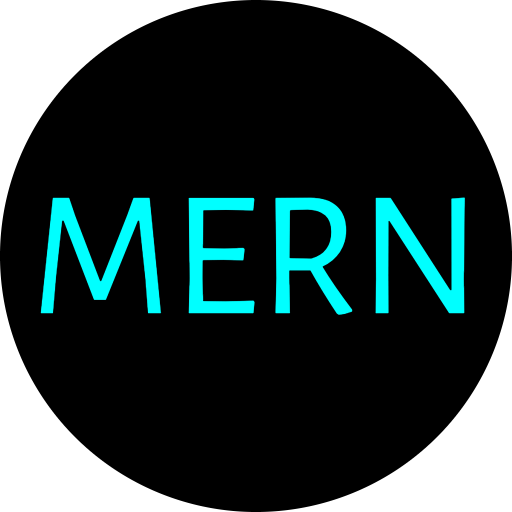

<!--
	README Template : https://github.com/othneildrew/Best-README-Template
-->

	

<!-- PROJECT LOGO -->
 

  

  <h3 align="center">MERN-Portifolio</h3>

  

    Projeto criado utilizando MERN Stack - MongoDB Atlas, Express.JS, React.JS e Node.JS
     
     
    <a href="https://mern-portifolio.herokuapp.com"><strong>Demo hospedado no Heroku</strong></a>
  

<!-- ABOUT THE PROJECT -->
## Sobre o Projeto

[![Screenshot do Projeto][product-screenshot]](https://mern-portifolio.herokuapp.com)

Projeto desenvolvido utilizando Javascript e JSON na camada front-end (React.JS) e back-end (Express.JS, Node.js, Mongo.DB).

[product-screenshot]: git_images/screenshot_home.png